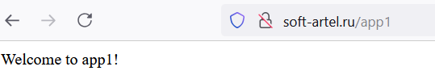
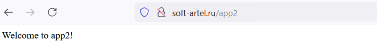

# Тестовое задание
стек: ubuntu 24, kubernetes

Задание можно показать:
1)	в виде доступа к настроенному кластеру
2)	в виде набора манифестов (ссылка на гит) для настройки k8s ноды до нужного состояния.

Требуется реализовать:
Kubernetes node на Ubuntu 24

namespace: api

deploy + service: 
-	app1 (2 реплики) - nginx или node.js app - просто отдает любую страницу
-	app2 (2 реплики) - nginx или node.js app - просто отдает любую другую(!) страницу

 - NGINX Ingress Controller:
/app1: 80, 443 -> app1: 80
/app2: 80, 443 -> app2: 80

Опционально, будет плюсом:
      - 	configmap для настройки параметров app1 и app2
-	nfs storage volume для app1 и app2
-	endpoint для доступа к внешней базе
-	ansible role для развертывания и настройки окружения

в качестве результата настройки Ingress Controller необходимо показать только дополнительные, настраиваемые манифесты (все что ставится по мануалу показывать не нужно)

---
Результат работы представлен в виде манифестов в папке templates *(два деплоймента и сервиса, конфигмап, ингрес)* и скриншотов работы кластера для двух приложений: 
- app1 

---
- app2 

